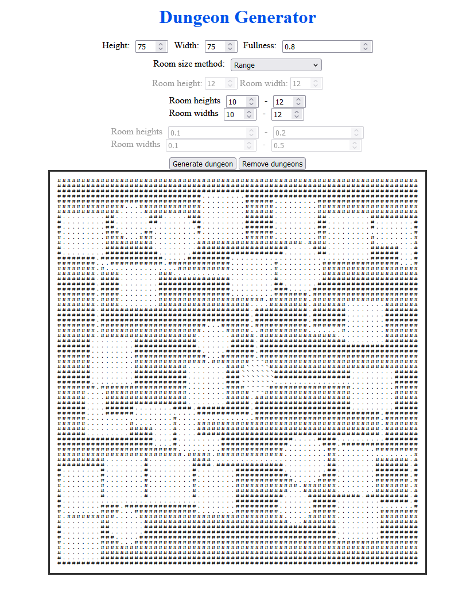
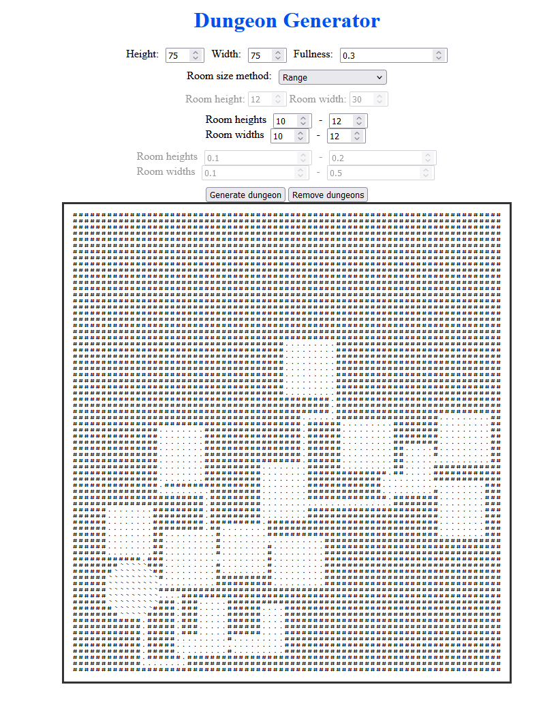
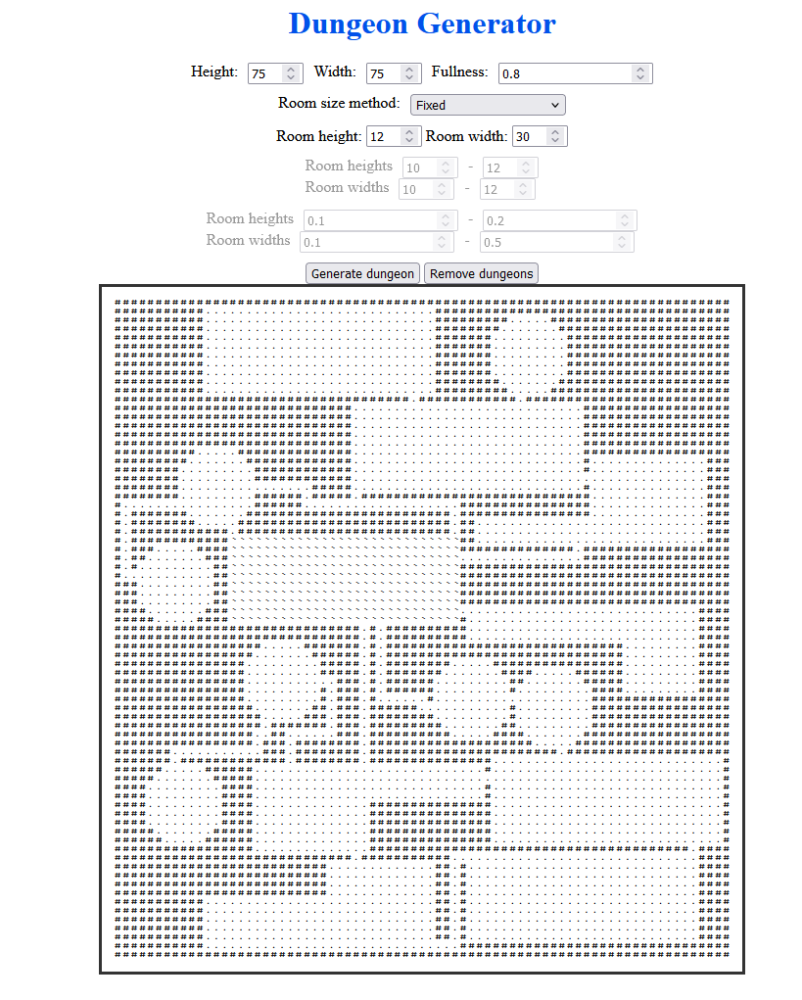
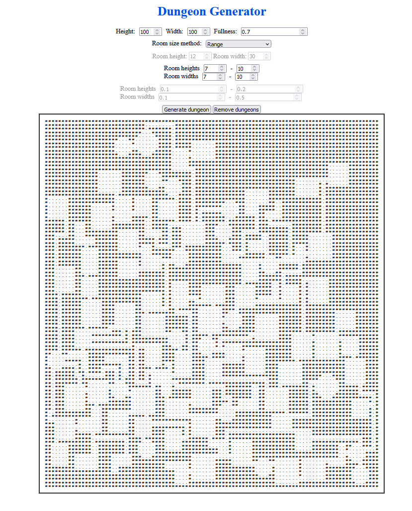

# Dungeon Generator
A django-based interface for my dungeon generator library (https://github.com/PinkieORG/hamingja_dungeon).

This is work-in-progress project for generating interesting, varied and highly customisable ASCII dungeon on a web.

Current parameters are: 
- size of the dungeon
- how much space the rooms and hallways take (fullness)
- size of the rooms given by either:
  - fixed size
  - range that is randomly sampled
  - range given by factor of the dungeon size

## Example Images
### Example 1
Simple example where size of the rooms is given as a range.

 
 

### Example 2
Here the fullness parameter is decreased.

 
 

### Example 3
Room size is fixed and room width is larger then the height.

 
 

### Example 4
This was created by making the dungeon area larger and the room sizes smaller.

